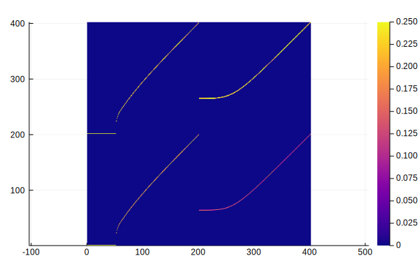
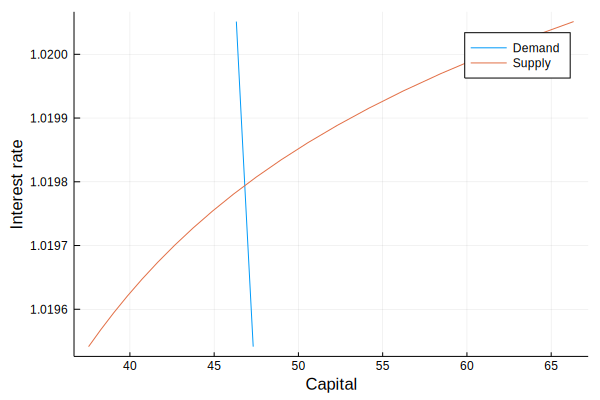
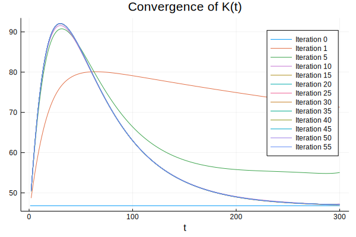
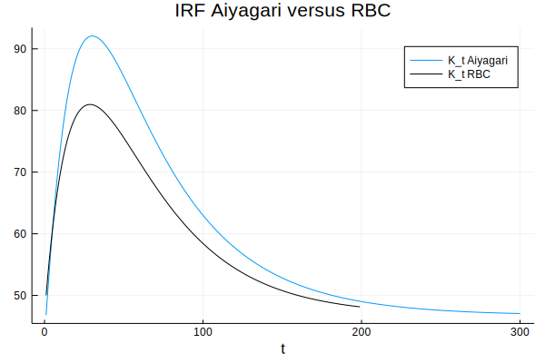
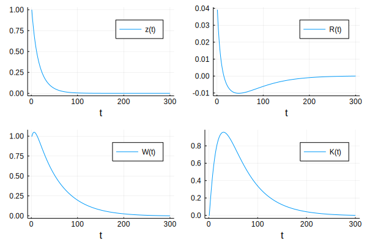
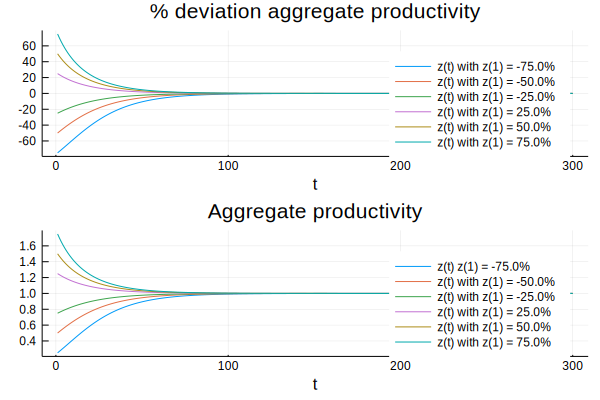
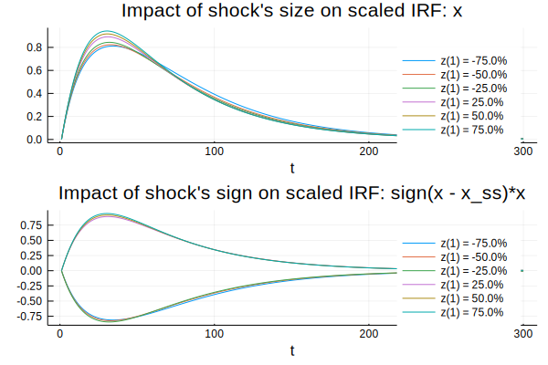
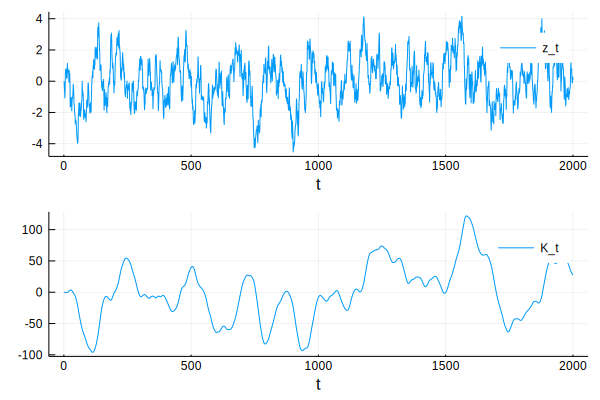

# Aiyagari Model with Aggregate Uncertainty

## Introduction

The Bewley-Huggett-Aiyagari-Imohoroğlu economies are the workhorse of modern macroeconomics. In these economies, markets are "incomplete". Agents cannot fully insure against risk and as results, households “self-insure” by holding a safe asset to smooth their consumption (see [Ljungqvist and Sargent (2018)](https://mitpress.mit.edu/books/recursive-macroeconomic-theory-fourth-edition) for a textbook treatment of this topic).

In this notebook, I consider the model of Aiyagari (1994). While the original model abstracts from aggregate fluctuations, Economists have developed several techniques to simulate out-of-steady-state dynamics for this class of models.

Here, I use a methodology that is quite general. It is a **3-step procedure**, which proceeds as follows:

1. Solve for the non-stochastic steady-state
2. Perturbe the model around its non-stochastic steady-state
3. Use the perturbation to calculate out-of-steady-state dynamics

I use the [BKM and GenBKM](https://julienpascal.github.io/post/genbkm/) algorithms for step 2 and 3, which means that the only theoretical tool needed is **backward induction** (i.e. knowing the value tomorrow, what is the value today?).

What are the cons of the methodology presented here? First, the methodology assumes a **small aggregate shock**. The idea is that if the economy is hit a by a small aggregate shock and that aggregate uncertainty vanishes, then the economy eventually goes back to its non-stochastic steady-state. If the shock is large, the value of steady-state may be altered and the methodology presented here is not adequate. An example of a large shock could be the disruption caused by COVID-19.

This methodology also fails when the non-stochastic steady-state is not relevant for the dynamic economy. This can problematic in portfolio choice problems in which portfolios are indeterminate when aggregate uncertainty vanishes (see [Coeurdacier et al (2011)](https://hal-sciencespo.archives-ouvertes.fr/hal-00972801/document)).

On the pro side, the methodology presented in this notebook is fast (orders of magnitude faster than [Krusell-Smith (1998)](https://notes.quantecon.org/submission/5bb58d1e11611400157fdc8d)) and transparent.

## I. The Model


In the model of Aiyagari (1994), there is continuum of agents each maximizing an infinite flow of discounted utility:

$$ E_{0} \sum_{t=0}^{\infty} \beta^t U(c_t) $$

subject to the constraint that how much they consume and how much they save in period $t$ (the left hand side of the next equation) should be equal to their labor earnings, plus their savings from last period (the right hand side of the next equation):

$$ c_t + a_{t+1} = w_t l_t + (1 + r_t) a_t $$

The variable $l_t$ captures idiosyncratic risk in labor earnings and could be interpreted as unemployment risk. There is also the assumption that consumption cannot be negative and that agents cannot borrow more than a certain amount $B$:

$$ c_t \geq 0 $$

$$ a_t \geq -B $$

The behavior of firms can be summarized by a representative firm hiring workers and capital:

$$ Y_t = z_t K_t^{\alpha} L_t^{1-\alpha} $$

where $Y_t$ is total output, $K_t$ is the aggregate capital level and $L_t$ is the aggregate labor supply. The variables $w_t$ and $r_t$ are pinned down each period by the first order conditions (FOCs) for a maximizing firm. Note that at the non-stochastic steady-state $z_t = z_{SS} = 1$ (by definition) and both $w_t$ and $r_t$ are constant. Another thing to notice is that because agents have to take into consideration $w_t$ and $r_t$ when making decisions, the cross-sectional distribution of agents across capital and idiosyncratic states matters (through the FOCs of the representative firm).

## II. Methodology

To solve for individual policy functions, I use the endogenous grid method (EGM) of Carroll (2006). The main idea of this method is to start from the end-of-period level of capital. Using the Euler equation, one may recover the beginning-of-period consumption and level of capital without using a root-finding algorithm.

To determine the non-stochastic equilibrium, I solve for the fixed-point problem over the aggregate capital level f(K*) = 0 using [Brent's method](https://en.wikipedia.org/wiki/Brent%27s_method).

To calculate the response of the economy to one-period unforeseen aggregate shock (an "MIT shock"), I use a standard backward-forward ["shooting" method](https://en.wikipedia.org/wiki/Shooting_method):
1. holding the path of aggregate capital $\{K_t\}_{t=1}^{T}$, calculate the policy functions
2. holding constant the policy functions, calculate the aggregate capital $\{K_t\}_{t=1}^{T}$
3. repeat until convergence of the path for aggregate capital $\{K_t\}_{t=1}^{T}$

To simulate out-of-steady-state dynamics, I use the [BKM algorithm](https://ideas.repec.org/a/eee/dyncon/v89y2018icp68-92.html), which relies on the assumption that the response of the economy to an aggregate shock $d_t$ is **linear** with respect to the **aggregate state** $z_t$:

$$ d_t = z_t d(1, 0, 0, ...) + z_{t-1}d(0, 1, 0, ...) + z_{t-2}d(0, 0, 1, ...) + ... $$

or more compactly:

$$ d_t = \sum_{k=0}^{+\infty} z_{t-k} d_{k} $$

where

$$ d_{1} = d(1,0,0,...)$$
$$ d_{2} = d(0,1,0,...)$$
$$ d_{3} = d(0,0,1,...)$$

That is, the evolution of equilibrium variables is a moving average of past shocks. However, by calculating several trajectories after an MIT shock, one sees that linearity assumption is slightly violated. Hence, I use the [GenBKM algorithm](https://irihs.ihs.ac.at/id/eprint/4500/), which is a refinement of the BKM algorithm taking into consideration these slight violations of linearity.

## III. Implementation

These ideas are implemented using [Julia](https://julialang.org/)


```julia
versioninfo()
```

    Julia Version 1.3.0
    Commit 46ce4d7933 (2019-11-26 06:09 UTC)
    Platform Info:
      OS: Linux (x86_64-pc-linux-gnu)
      CPU: Intel(R) Core(TM) i7-8850H CPU @ 2.60GHz
      WORD_SIZE: 64
      LIBM: libopenlibm
      LLVM: libLLVM-6.0.1 (ORCJIT, skylake)


### II. A Dependencies


```julia
using Distributions
using Plots
using DataFrames
using Random
using ForwardDiff
using LinearAlgebra
using Interpolations
using DataFrames
using Optim
using IterativeSolvers
#plotlyjs()
Random.seed!(1234);
```


```julia
using NBInclude #To load stuct and functions from other notebooks
```


```julia
@nbinclude("utils.ipynb") #mutable structs and primitive functions for the model
@nbinclude("RBC.ipynb")   #Aiyagari model, without the borrowing constraint (standard RBC)
@nbinclude("EGM.ipynb")   #implementation of the EGM method
@nbinclude("SteadyState.ipynb") #to calculate the non-stochastic steady-state
@nbinclude("GenBKM.ipynb") #to simulate the stochastic model using the GenBKM algorithm
```

    Steady state: [1.0, 1.0204081632653061, 45.63711005516377, 4.610279485164506, 3.697537284061231]Epsilon state: [0.0]Convergence flag = 1


    GenBKM_path! (generic function with 1 method)


### II.B Steady-state

#### Finding the steady-state value of capital

Finding the non-stochastic equilibrium is a fixed-point problem over the aggregate capital level f(K*) = 0, which can be solved using [Brent's method](https://en.wikipedia.org/wiki/Brent%27s_method):


```julia
p = Params() #struct with model parameters
z_ss = 1.0 #aggregate productivity at the non-stochastic steady-state
@time oo = optimize(K -> eq_K(K,p), 10, 100, Brent()) #solve for the steady-state value of capital using Brent method
K_star = oo.minimizer;
println("Steady-state value of capital K* = $(K_star)")
# Store the optimal policy function at the steady-state
g_star, c_star, g_low_star, g_high_star, success_flag= solve_EGM(x->log(x), x->log(x), R(K_star, z_ss, p), W(K_star, z_ss, p), p); #solve for policy functions
# Store the stationary distribution at the steady-state
t_star = make_trans_mat(g_star, p)    #generate transition matrix
d_star = get_stationary_dist(t_star); #stationary distribution
```

      6.711326 seconds (8.19 M allocations: 1.704 GiB, 2.93% gc time)
    Steady-state value of capital K* = 46.81669973104484


#### Visualizing transition probabilities


```julia
xs = [string("x", i) for i = 1:size(t_star,1)]
ys = [string("y", i) for i = 1:size(t_star,2)]
heatmap(t_star, aspect_ratio = 1, color=:plasma, clim=(0., 0.25))
```





*Notes: This graph shows the transition probabilities across capital and idiosyncratic probability states.*

#### Visualizing convergence toward the steady-state

One may visually check the equilibrium exists and is unique:


```julia
# Solve for the demand and supply of capital for different values of the interest rate
K_grid = collect(range(oo.minimizer-0.5, stop=oo.minimizer+0.5, length=20))
K_implied_grid = similar(K_grid)
R_grid = similar(K_grid)

for (K_index, K_value) in enumerate(K_grid)
    R_s, W_s = R(K_value, z_ss, p), W(K_value, z_ss, p) #calculate interest rate R and wage W
    gg, c_star, g_low, g_high, success_flag= solve_EGM(x -> log(x), x -> 2*log(x), R_s, W_s, p) #solve for policy functions
    tt = make_trans_mat(gg, p)   #generate transition matrix
    dd = get_stationary_dist(tt) #stationary distribution
    K_implied = aggregate_K(dd, p) #implied level of capital
    R_grid[K_index] = R_s #store interest rate
    K_implied_grid[K_index] = K_implied #store demand of capital
    K_grid[K_index] = K_value #store supply of capital
end

# Plot demand and supply of capital
plot(K_grid, R_grid, label = "Demand", ylabel="Interest rate", xlabel="Capital")
plot!(K_implied_grid, R_grid, label = "Supply")
```





*Notes: This graph shows the demand and the supply of capital as a function of the interest rate.*

### II.C MIT Shock

#### Backward and forward updates

The next block of code implements the backward-forward shooting method:
1. holding the path of aggregate capital $\{K_t\}_{t=1}^{T}$, calculate the policy functions
2. holding constant the policy functions, calculate the aggregate capital $\{K_t\}_{t=1}^{T}$


```julia
function backward_update(g_low_ss::Function, g_high_ss::Function, K_path_guess::Array{Float64,1}, z_path::Array{Float64,1}, p::Params)
    """
    Update policy functions backward, holding {K_t,z_t} constant
    [TODO] Should be a function that updates: a_path, R_path, W_path, g_low_path, g_high_path
    """
    nT = length(z_path)
    g_low_path = Array{Function}(undef,nT) #initialize two lists of functions
    g_high_path =  Array{Function}(undef,nT)
    g_low_path[nT] = g_low_ss
    g_high_path[nT] = g_high_ss
    a_path = zeros(p.nI, p.grid_size, nT) #to store policy functions on savings grid
    R_path = zeros(nT) #to store the interest rate on path
    W_path = zeros(nT) #to store the wage on path

    #Start from the steady-state and iterate backward
    #holding constant the path for {K_t,z_t}
    #---------------------------------------------------
    for t=nT:-1:2 #iterate backward
        # Next period
        R_path[t], W_path[t] = R(K_path_guess[t], z_path[t], p), W(K_path_guess[t], z_path[t], p)
        # Current period
        R_path[t-1], W_path[t-1] = R(K_path_guess[t-1], z_path[t-1], p), W(K_path_guess[t-1], z_path[t-1], p)
        # Current period's policy, given next period
        a_path[:,:,t-1], c_new, g_low_path[t-1], g_high_path[t-1] = euler_back(g_low_path[t], g_high_path[t], R_path[t-1], W_path[t-1], R_path[t], W_path[t], p)
    end

    return a_path, g_low_path, g_high_path
end

function forward_update(K_star::Float64, a_path::Array{Float64,3}, d_ss::Array{Float64,1}, p::Params)
    """
    Update forward the distribution of agents + aggregate capital
    dd_path_forward, K_path_forward
    """
    nT = length(z_path)
    K_path_forward = zeros(nT)
    K_path_forward[1] = K_star
    dd_path_forward = zeros(size(d_ss,1), nT)
    dd_path_forward[:,1] = d_ss
    #2. Iterate forward {K_t,z_t}, using the policy
    #functions from step 1
    #-----------------------------------------------
    for t=2:nT
        tt = make_trans_mat(a_path[:,:,t-1], p) #generate transition matrix
        dd_path_forward[:,t] = tt*dd_path_forward[:,t-1]
        K_path_forward[t] = aggregate_K(dd_path_forward[:,t], p)
    end

    return dd_path_forward, K_path_forward
end
```


    forward_update (generic function with 1 method)


#### Finding the transition path

One problem with backward-forward shooting method is that updating the path for $\{K_t\}_{t=1}^{T}$ "too quickly" may result in the overall procedure to diverge. An easy fix is to take a convex combination of the
previous guess and the newly calculated path, with $\lambda$ small:

$\{K^{NEW}_t\}_{t=1}^{T} = \lambda \{K_t\}_{t=1}^{T} + (1-\lambda)\{K^{OLD}_t\}_{t=1}^{T}$

The next function implement this idea, with the extra feature that $\lambda$ increases when distance between two iterations is getting small (too speed up convergence) and decreases when the distance is getting bigger (to prevent divergence) (see [this excellent notebook](https://notes.quantecon.org/submission/5b3faf1fb9eab00015b89f9a)).


```julia
function solve_mit!(K_path, g_low_ss::Function, g_high_ss::Function, d_ss::Array{Float64,1},
                    K_ss::Float64, z_path::Array{Float64,1}, p::Params; convex_combination::Float64 = 0.2,
                    shrink_factor::Float64 = 0.5, expand_factor::Float64 = 1.05,
                    max_iter::Int64 = 1000, tol::Float64=1e-6, verbose::Bool=true, display_iter::Int64 = 20)
    """
    Finds the path for aggregate capital K_path
    """
    diff = Inf #initialization
    diff_old = Inf #initialization
    convergence_flag = 0 #initialization
    damp = convex_combination #initial dampening parameter

    for i_mit=1:max_iter

        # Step 1. Solve backward the policy functions {g_t(a,e_low), g_t(a,e_high)}, keeping {K_t,z_t} constant:
        a_path, g_low_path, g_high_path = backward_update(g_low_ss, g_high_ss, K_path[i_mit], z_path, p);

        #2. Solve forward {K_t,z_t}, keeping policy functions {g_t(a,e_low), g_t(a,e_high)} constant:
        dd_path_forward, K_path_forward = forward_update(K_ss, a_path, d_star, p);

        # Distance between guess for {K_t} and implied values:
        diff = maximum(abs.(K_path_forward - K_path[i_mit]))

        # Display every display_iter iterations
        if verbose==true
            if mod(i_mit,display_iter) == 0
                println("Iteration $(i_mit). diff = $(diff)")
            end
        end

        if diff < tol
            if verbose==true
                println("Convergence reached after $(i_mit) iterations.")
            end
            convergence_flag = 1
            break
        else
            # Update the guess for the path {K_t}
            # Decrease the dampening factor
            if diff > diff_old
                damp = max(min(damp * shrink_factor, 1.0-eps()), eps())
            # Increase the dampening factor
            else
                damp = max(min(damp * expand_factor, 1.0-eps()), eps())
            end
            if mod(i_mit, 10) == 0
                if verbose==true
                    println("damp = $(damp); diff = $(diff)")
                end
            end
            # Store the updated path for {K_t}
            push!(K_path, damp.*K_path_forward .+ (1.0 - damp).*K_path[i_mit])
            diff_old = diff

        end
    end

    return K_path, convergence_flag
end
```


    solve_mit! (generic function with 1 method)


#### Find the path for {K_t} for a 1 std. dev positive productivity shock


```julia
max_t = 300 #Let us assume that the economy is back to the steady state after max_t periods
z_ss = 1.0  #Value of aggregate productivity at the non-stochastic steady-state
z_shock = 2.0 #Value of the inital shock

# Let's generate a path for the aggregate shock
z_path = ones(max_t)
z_path[1] = z_ss*z_shock #initial shock

# Evolution of aggregate productivity in level:
for t_index=2:max_t
    z_path[t_index] = z_path[t_index-1]^p.rho
end

# Heroic guess for the initial path of {K_t}: K_t = K* for all t
K_path = []
push!(K_path, repeat([K_star], max_t))

# Find the path for {K_t}:
@time K_path, convergence_flag = solve_mit!(K_path, g_low_star, g_high_star, d_star, K_star, z_path, p, convex_combination=0.25);

# Find the path for other aggregates:
R_path = zeros(length(z_path)) #to store the interest rate on path
W_path = zeros(length(z_path)) #to store the wage on path
for t=length(z_path):-1:1 #iterate backward
    # Next period
    R_path[t], W_path[t] = R(K_path[end][t], z_path[t], p), W(K_path[end][t], z_path[t], p)
end
```

    damp = 0.19391602699731453; diff = 1.1266234380049411
    Iteration 20. diff = 0.027666426981980408
    damp = 0.15041370210569288; diff = 0.027666426981980408
    damp = 0.24500807115366596; diff = 0.0012299247880207531
    Iteration 40. diff = 0.00011995358673289047
    damp = 0.19004396696157702; diff = 0.00011995358673289047
    damp = 0.1474102841119917; diff = 2.6711131440038116e-6
    Convergence reached after 56 iterations.
      8.565929 seconds (9.57 M allocations: 32.818 GiB, 15.22% gc time)


#### Visualize convergence of the transition path

The first guess for $\{K_t\}_{t=1}^{T}$ is that it equal to $K*$ for each period. Very quickly, the path for $\{K_t\}_{t=1}^{T}$ converges to the perfect foresight transition path:


```julia
p0 = plot(1:max_t, K_path[1], label= "Iteration 0", title="Convergence of K(t)")
plot!(p0, 2:max_t, K_path[2][2:end], label = "Iteration 1")
show_every = 5 #display {K_t} for each multiple of show_every
for k in 2:length(K_path)
    if mod(k,show_every) == 0
        plot!(p0, 2:max_t, K_path[k][2:end], xlabel="t", label = "Iteration $(k)", title="Convergence of K(t)", legend=:best)
    end
end

p0
```





*Notes: This graph shows the path for capital {K_t}^(i) for different iterations of the backward-forward algorithm*

#### Removing the borrowing constraint

The next graph compares shows what happens to an Aiyagari model without borrowing constraint. With no borrowing constraint, the aggregate level of capital reacts less to an aggregate shock in productivity:


```julia
p1 = plot(1:max_t, K_path[end], label= "K_t Aiyagari", title="IRF Aiyagari versus RBC")
plot!(p1, xx[RBCp.iK,2:end] .+ K_star, label = "K_t RBC", color = "black", xlabel="t")
```





*Notes: This graph shows the impulse response of K_t of for the Aiyagari model and a RBC model.*


```julia
p1 = plot(1:max_t, z_path./z_path[end] .-1, label = "z(t)", xlabel= "t")
p2 = plot(1:max_t, R_path./R_path[end] .-1, label= "R(t)", xlabel= "t")
p3 = plot(1:max_t, W_path./W_path[end].-1 , label= "W(t)", xlabel= "t")
p4 = plot(1:max_t, K_path[end]./K_path[end][end] .-1, label= "K(t)", xlabel= "t" )

p5 = plot(p1, p2, p3, p4)
```





*Notes: This graph shows the percentage deviation from steady-state values of (i) aggregate productivity (ii) the interest rate (iii) wages (iv) capital.*

#### Linearity checks

To simulate the stochastic economy, the BKM algorithm makes the assumption that an MIT shock is linear with
respect to the aggregate shock. That is, doubling the initial shock will simply double the value of aggregates
along the transition path, but the shape of transition paths will remain the same. The next block of codes
calculates several transition paths for different initial aggregate shocks.


```julia
max_t = 300 #Let us assume that the economy is back to the steady state after max_t periods
z_ss = 1.0  #Value of aggregate productivity at the non-stochastic steady-state
# Different initial shocks
array_sigma = collect(range(-0.75, stop=0.75, step=0.25))
# Let's exclude sigma = 0
array_sigma = array_sigma[array_sigma .!= 0.]
# To store the different scaled IRF:
x_mit_scaled_sigma = zeros(max_t, length(array_sigma))
# To store path of aggregate productivity:
z_path_sigma = zeros(max_t, length(array_sigma))
# To store the path for the %deviation of aggregate productivity from its steady-state value
z_path_sigma_dev = zeros(max_t, length(array_sigma))

for (index_sigma, sigma) in enumerate(array_sigma)

    # Let's generate a path for the aggregate shock
    z_path = ones(max_t)
    z_path[1] = z_ss + z_ss*sigma

    # Evolution of aggregate productivity in level:
    for t_index=2:max_t
        z_path[t_index] = z_path[t_index-1]^p.rho
    end

    # Heroic guess for the initial path of {K_t}: K_t = K* for all t
    K_path = []
    push!(K_path, repeat([K_star], max_t))

    # Find the path for {K_t}:
    @time K_path, convergence_flag = solve_mit!(K_path, g_low_star, g_high_star, d_star, K_star, z_path, p, convex_combination=0.2, verbose=false);

    # Check for convergence
    if convergence_flag!=1
        error("No convergence for z(1) = $(z_path[1]).")
    end

    # store the path for z:
    z_path_sigma[:, index_sigma] = z_path

    # store for the %deviation of aggregate productivity from its steady-state value
    z_path_sigma_dev[:, index_sigma] = z_path./z_ss .- 1.0

    # Scaled IRF: how a percentage deviation in z_t from its steady-state results in a % deviation of k_t
    x_mit_scaled_sigma[:, index_sigma] = (K_path[end]./K_star .- 1.0)./z_path_sigma_dev[1, index_sigma]

end
```

      7.818212 seconds (8.03 M allocations: 31.009 GiB, 16.63% gc time)
      6.864605 seconds (7.55 M allocations: 29.253 GiB, 17.11% gc time)
      6.597345 seconds (7.40 M allocations: 28.668 GiB, 17.29% gc time)
      6.732813 seconds (7.40 M allocations: 28.668 GiB, 17.15% gc time)
      7.174961 seconds (8.00 M allocations: 31.008 GiB, 16.84% gc time)
      7.204724 seconds (8.00 M allocations: 31.008 GiB, 16.86% gc time)


```julia
p0 = plot()
p1 = plot()
p2 = plot()
p3 = plot()

for (index_sigma, sigma) in enumerate(array_sigma)
    if index_sigma == 1
        p0 = plot(100 .*z_path_sigma_dev[:, index_sigma], label="z(t) with z(1) = $(round(100 .*z_path_sigma_dev[1, index_sigma], digits=2))%")
        p1 = plot(z_path_sigma[:, index_sigma], label="z(t) z(1) = $(round(100 .*z_path_sigma_dev[1, index_sigma], digits=2))%")
        p2 = plot(x_mit_scaled_sigma[:, index_sigma], label="z(1) = $(round(100 .*z_path_sigma_dev[1, index_sigma], digits=2))%")
        p3 = plot(sign(z_path_sigma[1, index_sigma] - z_ss)*x_mit_scaled_sigma[:, index_sigma], label="z(1) = $(round(100 .*z_path_sigma_dev[1, index_sigma], digits=2))%")
    else
        plot!(p0, 100 .*z_path_sigma_dev[:, index_sigma], label="z(t) with z(1) = $(round(100 .*z_path_sigma_dev[1, index_sigma], digits=2))%", title = "% deviation aggregate productivity", xlabel="t")
        plot!(p1, z_path_sigma[:, index_sigma], label="z(t) with z(1) = $(round(100 .*z_path_sigma_dev[1, index_sigma], digits=2))%", title = "Aggregate productivity", xlabel="t")
        plot!(p2, x_mit_scaled_sigma[:, index_sigma], label="z(1) = $(round(100 .*z_path_sigma_dev[1, index_sigma], digits=2))%", title = "Impact of shock's size on scaled IRF: x", xlabel="t")
        plot!(p3, sign(z_path_sigma[1, index_sigma] - z_ss)*x_mit_scaled_sigma[:, index_sigma], label="z(1) = $(round(100 .*z_path_sigma_dev[1, index_sigma], digits=2))%", title = "Impact of shock's sign on scaled IRF: sign(x - x_ss)*x", xlabel="t")
    end
end
```


```julia
plot(p0,p1, fg_legend = :transparent, legend=:best, layout=(2,1))
```





*Notes: This graph shows the percentage deviation of aggregate productivity from its steady-state value (top panel) and aggregate productivity in level (bottom panel) for different initial shocks.*


```julia
plot(p2,p3, fg_legend = :transparent, legend=:best, layout=(2,1))
```





*Notes: The top panel shows the scaled impulse response function of capital for different aggregate shocks. The bottom panel shows the scaled impulse response function of capital for different aggregate shocks, multiplied by the sign of the aggregate shock.*

### II.D. Out-of-steady-state dynamics


```julia
max_t = 2000
shocks_t = rand(Normal(0,0.005), max_t) # Series of aggregate shocks
# Let's generate a path for the aggregate shock
z_path = ones(max_t)
z_path[1] = z_ss

# Evolution of aggregate productivity in level:
for t_index=2:max_t
    z_path[t_index] = z_path[t_index-1]^p.rho + shocks_t[t_index]
end

# Calculation of GenBKM path:
XT_GenBKM = zeros(max_t);# Initialization
@time GenBKM_path!(XT_GenBKM, max_t, x_mit_scaled_sigma, z_path./z_ss .- 1.0, array_sigma)
```

      0.237683 seconds (1.06 M allocations: 50.188 MiB)


```julia
p1 = plot(100 .*(z_path./z_ss .- 1.0), label="z_t", xlabel="t")
p2 = plot(100 .*XT_GenBKM, label = "K_t", xlabel="t")
plot(p1,p2, fg_legend = :transparent, legend=:best, layout=(2,1))
```





*Notes: The top panel shows the percentage deviation of aggregate productivity from its steady-state value. The bottom panel shows the percentage deviation of capital from its steady-state value.*

## Conclusion

This notebook present the model of Aiyagari (1994) and a general three-step procedure to simulate out-of-steady-state dynamics for models of this class for "small" shocks. Solving this class of model for large shocks seems to be [much more complicated](https://www.google.com/search?client=ubuntu&channel=fs&q=Probabilistic+Theory+ofMean+Field+Gameswith+Applications+II&ie=utf-8&oe=utf-8) and is still an active area of research.

## Links

* An excellent course on heterogeneous agent models with code in Matlab, Python and Julia: https://alisdairmckay.com/Notes/HetAgents/index.html
* More on the EGM method: https://julia.quantecon.org/dynamic_programming/egm_policy_iter.html
* More on the Aiyagari model: https://python.quantecon.org/aiyagari.html
* Aiyagari model in continuous time: https://nbviewer.jupyter.org/github/QuantEcon/QuantEcon.notebooks/blob/master/aiyagari_continuous_time.ipynb

## References

* Bewley, Truman. "A difficulty with the optimum quantity of money." Econometrica: Journal of the Econometric Society (1983): 1485-1504.
* Boppart, Timo, Per Krusell, and Kurt Mitman. “Exploiting MIT shocks in heterogeneous-agent economies: the impulse response as a numerical derivative.” Journal of Economic Dynamics and Control 89 (2018): 68-92.
* Christopher D Carroll. The method of endogenous gridpoints for solving dynamic stochastic optimization problems. Economics Letters, 91(3):312–320, 2006.
* Coeurdacier, Nicolas, Helene Rey, and Pablo Winant. "The risky steady state." American Economic Review 101.3 (2011): 398-401.
* Huggett, Mark. "The risk-free rate in heterogeneous-agent incomplete-insurance economies." Journal of economic Dynamics and Control 17.5-6 (1993): 953-969.
* İmrohoroğlu, Ayşe. "The welfare cost of inflation under imperfect insurance." Journal of Economic Dynamics and Control 16.1 (1992): 79-91.
* Ljungqvist, Lars, and Thomas J. Sargent. Recursive macroeconomic theory. MIT press, 2018.
* Reiter, Michael. “Comments on” Exploiting MIT Shocks in Heterogeneous-Agent Economies: The Impulse Response as a Numerical Derivative” by T. Boppart, P. Krusell and K. Mitman.” Journal of Economic Dynamics and Control 89 (2018): 93-99.
